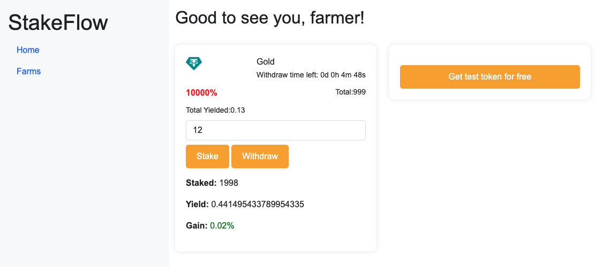

# StakeFlow
StakeFlow is a cutting-edge decentralized finance (DeFi) platform designed to streamline staking processes and maximize yield opportunities. Our project aims to provide users with a secure, efficient, and transparent way to stake their assets and earn rewards.

## Demo deploy to polygon
http://cryptodapprun.github.io/StakeFlow/

# Deploy
### 1.Deploy yield.sol to blockchain
### 2.modify contract address you just deploied in index.html
### 3.modify token address in index.html
### 4.put index.html to a web server.

   

